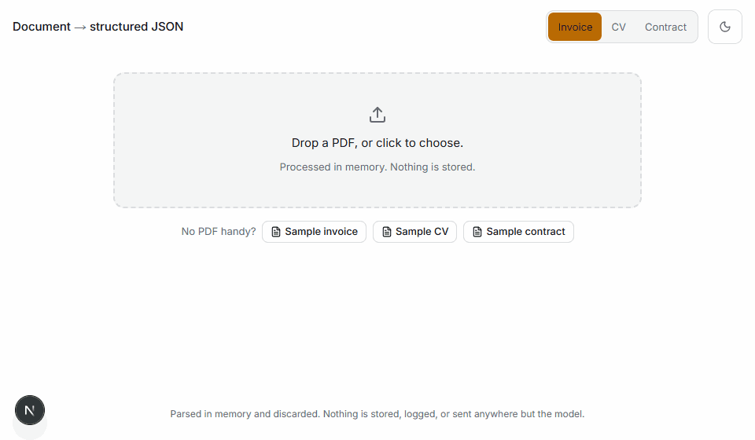
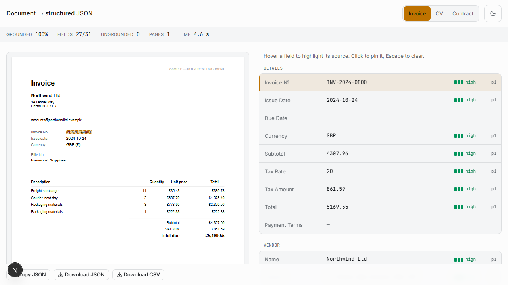
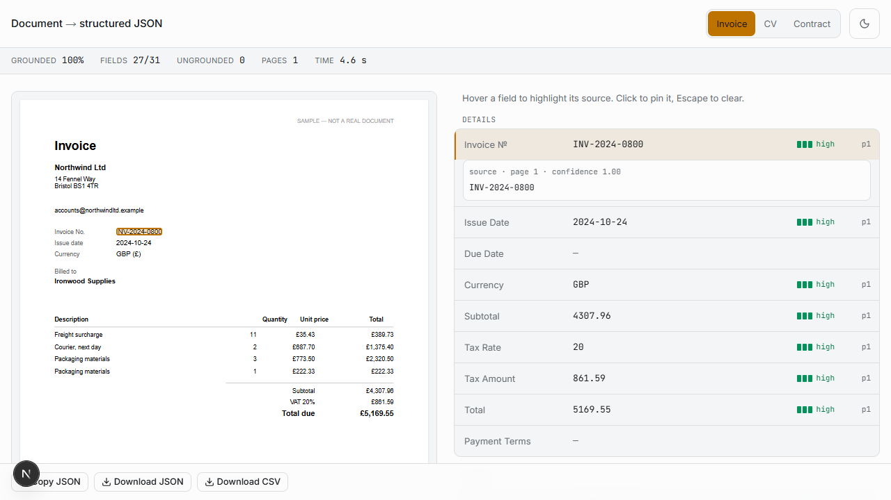
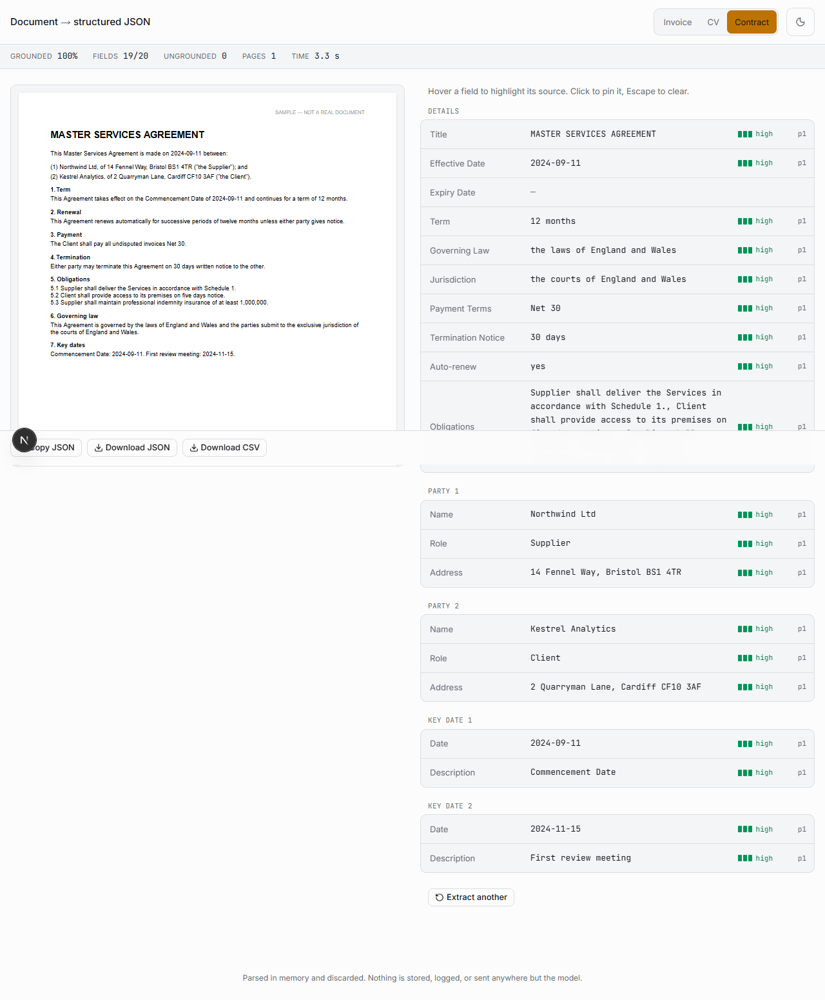
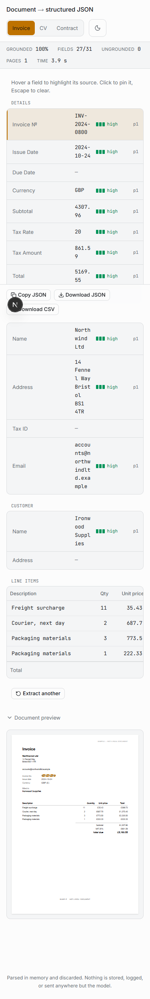

# Document → structured JSON

**Upload a PDF invoice, CV or contract and get back validated structured JSON where every
field carries the exact source text it came from.** Hover a field and the span it was read
from highlights in the rendered document; click and the highlight pins.

**→ Live: [pdf-extractor-hashim.vercel.app](https://pdf-extractor-hashim.vercel.app)** — three
sample documents are built in, so there is nothing to upload.

[](../../actions/workflows/ci.yml)




**Nothing is stored. Ever.** The PDF is parsed in memory, the JSON is streamed back to the
browser, and everything is discarded when the request ends. No database, no blob storage,
no logging of document content — which removes every privacy question a client would
otherwise ask, and costs nothing to run.

---

## Why this is different

"Extract data from these documents" is one of the highest-volume categories of freelance
work, and most submissions are a script that prints JSON. Two things separate this one:

**1. Provenance on every field.** Every value comes back as
`{ value, confidence, sourceText, page }` — never a bare string. The UI turns that into the
interaction above: you can see where each number came from without opening the PDF yourself.

**2. A grounding check, in code, on every request.** Before a result is returned the server
verifies that each `sourceText` really appears in the document *and* that the span actually
contains the value it was cited for. Anything failing either test is forced to
`confidence: 0` and rendered as **ungrounded**. Hallucinated values — and real spans quoted
for the wrong number — are caught automatically, with no human in the loop.

Everything else follows from those two decisions.

---

## Accuracy

50 synthetic fixtures, 1,326 labelled fields, `gemini-3.5-flash-lite`. Reproduce with
`npm run eval`; method and definitions in [`evals/RESULTS.md`](evals/RESULTS.md).

| Set | Docs | Field accuracy | Precision on present | Null accuracy | Hallucination rate | Grounding pass | Mean latency |
|---|---|---|---|---|---|---|---|
| invoice | 20 | 100.0% | 100.0% | 100.0% | 0.0% | 100.0% | 3.6 s |
| cv | 20 | 100.0% | 100.0% | 100.0% | 0.0% | 100.0% | 3.9 s |
| contract | 10 | 97.0% | 97.0% | 100.0% | 0.0% | 99.5% | 3.1 s |
| **all** | **50** | **99.5%** | **99.5%** | **100.0%** | **0.0%** | **99.9%** | **3.6 s** |

### Read that number honestly

99.5% is a **ceiling, not a promise**, and there are three reasons to discount it:

1. **The fixtures are generated by this repo.** Consistent fonts, a real text layer, one
   page each, no scans, no five-column invoice layouts, no two-page CV with a sidebar. Real
   documents are messier and will score lower.
2. **There is no held-out set.** The first run scored contracts at 92%. `evals/RESULTS.md`
   named `jurisdiction` and `governingLaw` as the misses, and I tightened the contract field
   spec in response — the model was returning "England and Wales" where the label wanted
   "the courts of England and Wales". A genuine ambiguity fix, but it was made *after seeing
   this eval*, so some of the last points are fitted to it.
3. **It is one model on one day.** Contracts moved between 97% and 99% across runs on
   identical inputs; treat a point or two as noise.

What the run does establish, and what would survive a harder corpus:

- **0% hallucination across 76 deliberately-omitted fields.** Every field the generator left
  out came back `null`, not invented. This is the number a client should care about most.
- **99.9% grounding pass.** Every value but one was traceable to a span that actually
  contains it — and that check runs in production, not only in the eval.
- **50/50 documents parsed and validated.** No schema failures, no retries exhausted.

The remaining misses are both free-text legal fields — `contract.terminationNotice` and
`contract.jurisdiction` — and they will stay the hard part. Contract language buries the
same idea in a hundred phrasings ("30 days written notice" / "one month's notice"), so the
fix is clause-level retrieval and a prompt per contract family, not a bigger model.

Numbers came off Google's free tier. A first attempt on `gemini-3.5-flash` exhausted the
daily quota after 11 documents; runs that never reach the model are excluded from the scores
rather than counted as wrong, because a provider outage is not an accuracy result.

**Showing the failures is deliberate.** Ungrounded fields get a dashed red border and a
badge rather than being quietly dropped. A field that says "I could not verify this" is
worth more than one that silently guesses.

---

## The interface

| | |
|---|---|
|  |  |
| Hovering a field highlights its source span in the PDF and scrolls it into view. | Clicking pins the highlight and shows the verbatim `sourceText` with its page and confidence. |
|  |  |
| The same pipeline across three schemas — this is a contract. | 375px: fields first, preview collapsible, no horizontal scroll. |

Dark and light both ship, with the toggle overriding the system preference
([dark](docs/dark.png)). Confidence is a three-segment bar **plus** a word (`high` /
`medium` / `low`), never colour alone.

---

## Quickstart

```bash
npm install
cp .env.example .env.local        # add a provider — see below
npm run fixtures                  # build the 50 synthetic PDFs + ground truths
npm run dev                       # http://localhost:3000
```

There are three sample documents built in, so the app is usable with **zero uploads**.

### Providers

All model access goes through one file, [`lib/llm.ts`](lib/llm.ts). Nothing else in the app
imports a provider, so switching to Claude or GPT is an edit to that file alone.

| Provider | Setup |
|---|---|
| **Google AI Studio** (free tier) | `LLM_PROVIDER=google` and `GOOGLE_GENERATIVE_AI_API_KEY=…` from [aistudio.google.com/apikey](https://aistudio.google.com/apikey). Model ids differ between keys — list yours with `GET https://generativelanguage.googleapis.com/v1beta/models` and set `GOOGLE_MODEL`. The free tier returns 503 under load, so `lib/llm.ts` retries with backoff. |
| **Ollama** (local, free) | `LLM_PROVIDER=ollama` and `ollama pull llama3.2`. Fully local eval runs, no quota. **Untested:** this path is written but has never been executed — no Ollama install was available. Expect to debug the `format` payload on first run. |

Rate limiting via Upstash Redis is optional — with no credentials the app runs unlimited,
and an Upstash outage fails **open** rather than taking extraction down with it.

### Commands

```bash
npm run dev        # local app
npm run fixtures   # regenerate the 50 synthetic PDFs and ground truths
npm run eval       # score against ground truth, writes evals/RESULTS.md
npm test           # 25 unit tests — no API key needed, the provider is stubbed
npm run e2e        # 8 Playwright tests against the real app and a real model
npm run demo       # re-record public/demo.gif
npm run build
```

`npm run eval` takes `-- --type invoice` and `-- --limit 5` for a quick pass.

---

## How it works

```
PDF upload
  → content-length / type / page-count guard   (rejected early, with a specific message)
  → unpdf → per-page text, tagged [page N]
  → prompt = JSON Schema (derived from Zod) + page-tagged document text
  → LLM in JSON mode
  → Zod parse                          (retried once with the validation error appended)
  → grounding check: does every sourceText appear verbatim, and support its value?
  → ungrounded fields forced to confidence 0
  → streamed to the client as NDJSON, one line per completed step
  → everything discarded
```

**The schema is the contract.** Zod defines it, the JSON Schema handed to the model is
derived from that same Zod object, and the response is parsed back through it. A response
that fails validation twice is returned as a structured error, never as a partial guess.

Three document types ship — **invoice**, **CV**, **contract** — as one Zod schema and one
prompt hint each, sharing the entire pipeline. Adding a fourth needs no UI work: the field
list walks whatever shape the schema produces.

### The grounding check

[`lib/grounding.ts`](lib/grounding.ts) is the most valuable file in the repo and it is under
sixty lines. It walks the parsed result and asks two questions of every field with a value:

1. Does `sourceText` appear in the document, under a whitespace-collapsed,
   case-insensitive comparison?
2. Does that span actually contain the value? `{ value: 99999, sourceText: "Northwind Ltd" }`
   cites a real span, but it is not evidence for 99999.

Failing either flags the field and zeroes its confidence. The second check is deliberately
lenient in three places, because the alternative is punishing correct work: booleans are
inferred rather than quoted, dates are legitimately reformatted (`14 March 2024` →
`2024-03-14`), and long free text is paraphrased.

This is why **confidence is advisory and grounding is the signal**. The confidence number is
the model's own estimate and is not calibrated — treat it as a hint. The grounding flag is
an objective check performed in code on every request.

### Finding the span in the browser

The client mirrors that same normalisation. [`components/doc-preview.tsx`](components/doc-preview.tsx)
walks pdf.js's rendered text layer with a `TreeWalker`, builds a whitespace-collapsed string
plus a character→DOM-node map, locates the needle, then builds a real DOM `Range` and reads
`getClientRects()` off it. That is what gives exact multi-line highlights rather than
per-word boxes — and it only works because the client and server normalise text identically.

---

## Testing

| Layer | What it covers |
|---|---|
| `npm test` — 25 unit tests | The grounding check in both directions (a fabricated span *and* a real span quoted for the wrong value are both caught), prototype pollution on the type guard, CSV escaping and formula injection, PDF guards including the no-text-layer path, and the full extract pipeline against a stubbed provider. No API key required. |
| `npm run e2e` — 8 Playwright tests | The real app in a real browser: hover→highlight asserted to produce a box with non-zero dimensions, click-to-pin, null fields as `—`, both export formats byte-checked, all three schemas, the theme toggle, 375px with zero horizontal overflow, and the non-PDF error path. |
| `npm run eval` | Field-level accuracy against 50 committed ground truths. |

The e2e suite earned its place immediately: it caught a bug where the PDF text layer rendered
**empty** because `onRenderTextLayerSuccess` had an unstable function identity, so react-pdf
cancelled and restarted the layer in a loop. The canvas still painted, so the page looked
fine in a screenshot — but hover-to-highlight, the whole point of the project, silently did
nothing. Nothing short of driving a real browser would have found it.

---

## Engineering decisions

**Text-only prompts, not vision.** Page-tagged text keeps every request inside the free tier
and holds latency at ~3.6s. The cost is layout blindness — see the ceilings below.

**NDJSON streaming with a stepper, not a spinner.** The route emits one line per completed
stage (`reading → extracting → validating → grounding`) and the UI ticks each green. The
steps are emitted where they actually happen, so the progress display cannot lie. Guards run
*before* the stream opens so rejections keep real HTTP status codes; the model call runs
inside it.

**One timeout budget, written down.** The route's `maxDuration` is 60s, so `lib/llm.ts` uses
a 25s request timeout and a single 3s backoff: 25 + 3 + 25 = 53s. The client also treats a
stream that ends without a terminal line as an error, because otherwise a killed function
leaves the stepper spinning forever.

**No provider SDK.** `lib/llm.ts` calls both Google and Ollama over `fetch`. Two paths, one
signature, no dependency to keep up with, and the abort signal threads from the client all
the way to the provider so a closed tab stops burning quota.

**Zod v4's built-in `z.toJSONSchema`** rather than `zod-to-json-schema`, which is Zod 3 only.

**Hover state keyed by object identity, not field paths.** The parsed result is a stable
object graph, so `field === hover` is all the comparison needed — no path strings to build,
pass around, or keep in sync.

**Deliberate shortcut, marked in the code:** every PDF page renders eagerly (max 20). Lazy
mounting would require the highlight to wait for the target page's text layer to exist,
which is exactly the coupling that produced the empty-text-layer bug above. It carries a
`ponytail:` comment naming the ceiling and the upgrade path.

---

## Fixtures

`npm run fixtures` generates 50 documents — 20 invoices, 20 CVs, 10 contracts — varying
layout, field order, date format and currency, and deliberately omitting some fields so null
handling is measured too. Ground truth is written alongside each PDF, exact by construction,
from a seeded PRNG so the whole set is reproducible by anyone who clones the repo.

**Every fixture is unmistakably synthetic**: invented companies, invented people, invented
addresses, and a visible `SAMPLE — NOT A REAL DOCUMENT` marker on the page. No real invoice,
CV or contract is used anywhere in this project.

---

## Known ceilings

- **No OCR.** A scanned PDF with no text layer is rejected with a clear message. Adding OCR
  means Tesseract or a vision model — real cost, real latency.
- **Text-only, no layout.** Table structure is inferred from text order, so unusual
  multi-column invoice layouts degrade. A layout-aware parser or a vision model fixes it.
- **Long documents are sampled**, not chunked: past 15 pages it extracts from the first 10
  and last 5 and says so in the UI. A map-reduce merge would be the next step.
- **Confidence is self-reported** by the model and not calibrated. The grounding check is the
  objective signal.
- **Grounding is document-wide, not per page.** A span cited with the wrong page number still
  passes; the client compensates by searching the cited page first, then everywhere.
- **English only.** Other languages are untested.
- **Nothing is persisted**, so there is no review queue, no correction workflow, and no
  learning from corrections. In a paid build, human-in-the-loop correction on low-confidence
  fields is where most of the remaining accuracy comes from.

---

## Project structure

```
app/
  page.tsx              upload → extract → review, one page
  api/extract/route.ts  POST multipart → streamed NDJSON
components/
  doc-preview.tsx       react-pdf viewer + the highlight overlay
  field-list.tsx        schema-agnostic grouping of any result shape
  field-row.tsx         value + confidence + provenance + ungrounded badge
lib/
  llm.ts                the only file that talks to a provider
  grounding.ts          the verbatim + value-support verifier
  schemas/              Zod definitions; the JSON Schema is derived from them
  pdf.ts  extract.ts  csv.ts  ratelimit.ts  errors.ts
evals/
  generate.ts  run.ts   fixture builder and scorer
  fixtures/             50 synthetic PDFs + 50 ground truths (committed)
  RESULTS.md            generated, committed
tests/                  node --test unit suites
e2e/                    Playwright
```

Limits, enforced server-side before parsing: **10 MB, 20 pages, PDF only.**

## Licence

MIT — see [LICENSE](LICENSE).
